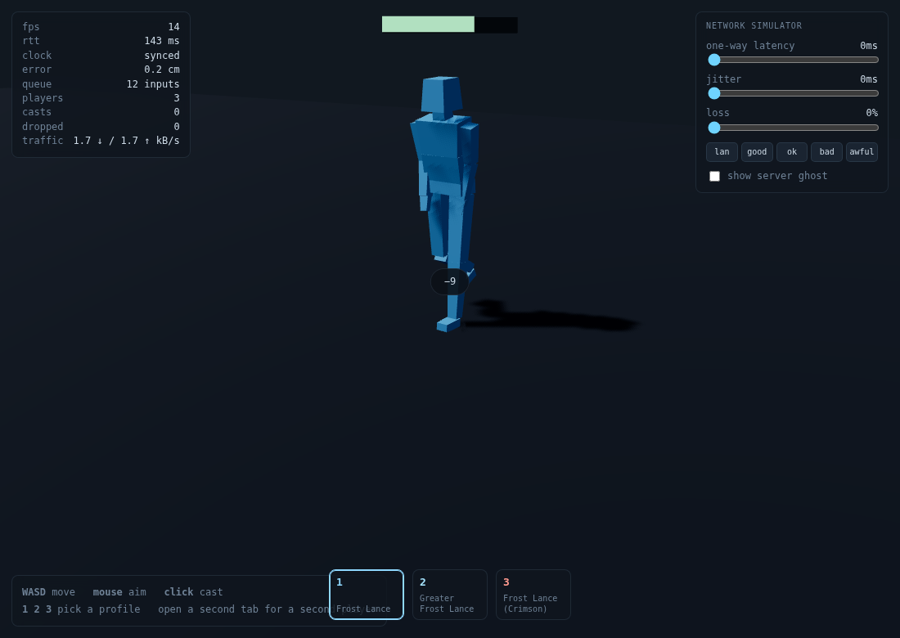
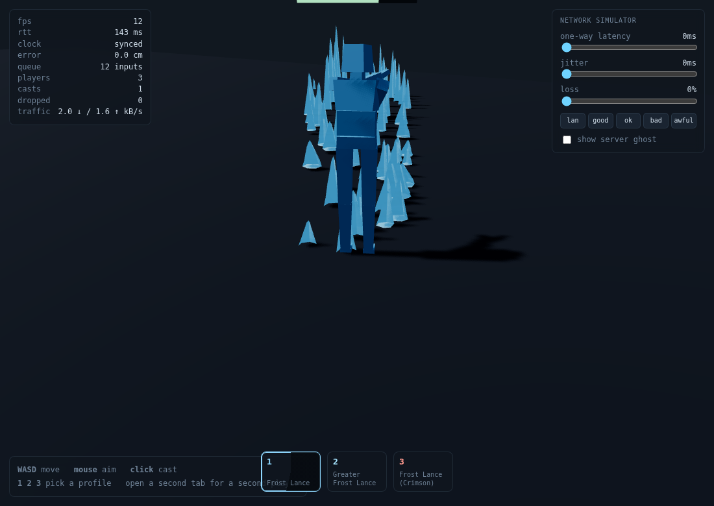

# slice — M0 / M1

Вертикальный срез сетевой боёвки: авторитетный сервер, клиентское предсказание,
интерполяция чужих персонажей и одно заклинание, реплицируемое пакетом в 21 байт.

Это не игра. Это ответ на вопрос «поедет ли вообще» — и инструмент, чтобы
смотреть, как оно ведёт себя под задержкой, джиттером и потерями, не выходя из
браузера.

Обоснование подхода — в [разборе песочницы](../docs/threejs-vfx-sandbox-analysis.md)
и [заметке про применимость к MMORPG](../docs/mmorpg-usable.md).

---

## Запуск

```bash
cd prototype
npm install
npm run dev
```

Откройте <http://localhost:5173> в двух вкладках — это два игрока. Третья вкладка
будет третьим. Чтобы добавить ботов:

```bash
BOTS=3 npm run dev:server
```

| Клавиша | Действие |
|---|---|
| `W A S D` | движение |
| мышь | прицел |
| ЛКМ | каст |
| `1` `2` `3` | выбрать профиль |

Панель справа — сетевой симулятор. Пресеты `lan / good / ok / bad / awful`
ставят задержку, джиттер и потери. **Играть надо на `bad`** — на localhost
хорошо себя чувствует любой неткод.

Сервер на Node 22 исполняет TypeScript нативно: билд-шага нет, `node
server/main.ts` и всё.

---

## Что здесь есть

### 1. Каст в 21 байте

```
type u8 │ casterId u16 │ profileId u16 │ seed u32 │ t0 u32
        │ originX i16 │ originZ i16 │ yaw u16 │ distance u16
```

Ни одной частицы, ни одной позиции кристалла, ни одного покадрового состояния.
Эффект — чистая функция этих полей и профиля, который они называют, поэтому
каждый зритель разворачивает **тот же самый** веер льда из того же 32-битного
сида. Размер зафиксирован тестом (`test/protocol.test.ts`), чтобы заявление в
документации не перестало быть правдой втихую.

### 2. Вход в середину каста

`t0` — момент начала по серверным часам. Клиент, подключившийся через секунду
после каста, получает тот же пакет и вычисляет `age = now − t0`: он видит
полусформированное поле льда, а не начало заново.

Это работает только потому, что положение фронта — **замкнутая форма**, а не
интегрирование. В песочнице `front += speed · easeIn · dt` каждый кадр; здесь тот
же самый разгон проинтегрирован аналитически:

```
front(a) = speed · (a²/T − a³/(3T²))      при a ≤ T = 0.08 с
         = speed · (2T/3 + (a − T))       при a > T
```

Ощущение не изменилось (тест сверяет замкнутую форму с численным интегралом
исходной кривой), но у каста больше нет истории — и появился корректный вход в
любой момент.

### 3. Профили вместо глобального синглтона

Главная правка относительно песочницы. Абилка по-прежнему **не хранит ни одной
размерности** и перечитывает каждый метр из объекта настроек каждый кадр — просто
читает тот объект, который ей вручили при спавне, а не единственный глобальный.

В слоте три профиля одного заклинания, и они одновременно на экране:

| Слот | Профиль | Отличие |
|---|---|---|
| 1 | Frost Lance | база: 15 м, урон 14, голубой |
| 2 | Greater Frost Lance | 21 м, шире полоса, урон 22, свой кулдаун |
| 3 | Frost Lance (Crimson) | цифры ранга 1, другая палитра — косметика |

Клиент **не выбирает профиль**. Он просит слот; сервер разрешает слот по
лоадауту игрока и кладёт на провод уже разрешённый id.

### 4. Предсказание и откат

Каст появляется в кадре нажатия, до того как сервер о нём услышал. Именно поэтому
**сид выбирает клиент**: сид ничего не решает в правилах, поэтому отдать его
клиенту ничего не стоит, а подтверждение описывает то же самое поле — `adopt`
поправляет origin, дальность и `t0`, а не подменяет заклинание другим.

Если сервер отказал (кулдаун, слишком близко, чужой слот) — предсказанный эффект
снимается. Если пакет потерялся и ответа нет — снимается по таймауту. Поднимите
`loss`, и вы это увидите.

### 5. Движение

Общий `applyInput` импортируется обоими концами, так что расходиться нечему.
Клиент применяет ввод немедленно, копит неподтверждённые, при снапшоте
прыгает на авторитетную позицию и переигрывает остаток. Чекбокс **show server
ghost** рисует каркас там, где сервер вас видит: при здоровом предсказании он
внутри тела, при больной задержке — отделяется.

Чужие рисуются на 100 мс позади серверных часов, между двумя снапшотами.

### 6. Персонажи

Не капсулы. Настоящий `SkinnedMesh` поверх скелета из семнадцати костей,
сгенерированный из таблицы пропорций — один draw call на персонажа, как у
нормального авторенного тела, потому что это и есть нормальное тело.

Анимация процедурная: ни одного клипа, ни одного микшера. Поза — функция от
трёх вещей: как быстро тело движется, сколько прошло и как давно оно кастовало.
Это осознанное эхо правила, на котором держится всё остальное: абилки песочницы
не хранят размерностей и разрешают всё из живых настроек каждый кадр, а это не
хранит кейфреймов и разрешает всё из живого состояния.

Три следствия:

* **Анимация не стоит ни байта на проводе.** Чужие идут, потому что двигается
  их интерполированная позиция; они кастуют, потому что пакет `S_CAST` и так
  приехал. Реплицировать нечего, значит нечему и рассинхронизироваться.
* **Ноги не скользят ни на какой скорости.** Фаза шага двигается **пройденным
  расстоянием**, а не временем. Цикл, привязанный ко времени, начинает скользить
  на первом же замедлении или бафе, и игроки читают скользящие ноги как дешёвку
  быстрее, чем что-либо другое в персонаже.
* **Заменяется в одном шве.** Кости адресуются по имени, и авторенный
  `AnimationClip` тоже биндится по имени. Когда этих поз перестанет хватать,
  `AnimationMixer` займёт место `animator.ts` и выше ничего не изменится —
  ровно так песочница играет клипы из трёх чужих FBX на своём риге.

Чего это **не** даёт: авторской пластики. У поставленного вручную каста есть
тайминг и вес, которых у синуса нет, и настоящему MMO в итоге нужны оба слоя —
процедурная локомоция снизу, авторенные однократные сверху. Структура это уже
позволяет, меняется только содержимое одного файла.

`height` в таблице пропорций — настоящий параметр: силуэт масштабируется под
него. Расы, «этот гном» и NPC-ребёнок — это одно число.




### 7. Авторитет сервера

Ровно в четырёх местах, и это перечислимо:

1. `dt` зажат в общем шаге + бюджет движения на тик — поток поддельного ввода не
   даёт лишних метров;
2. origin каста — серверный, если клиент заявил дальше `ORIGIN_TOLERANCE` = 1.5 м;
3. профиль разрешается из лоадаута по индексу слота;
4. кулдауны живут на сервере.

Сид в этот список намеренно не входит.

---

## Что проверено

```
npm test        # 25 тестов, node:test, без раннеров
npm run check   # tsc --noEmit
```

25/25 проходят, типы чистые. Тесты покрывают не декорации, а заявления:

- замкнутая форма совпадает с численно проинтегрированной кривой песочницы;
- `ageAtDistance` действительно обращает `frontAt` в обоих режимах;
- `S_CAST` ровно 21 байт и переживает round-trip в пределах квантования;
- переигранное предсказание сходится с сервером до 1e-9 м;
- диагональ не быстрее прямой, завышенный `dt` не даёт метров, поток из 200
  поддельных вводов упирается в бюджет тика;
- нельзя скастовать профиль не из лоадаута, нельзя обойти кулдаун, каст ближе
  `minRange` отклоняется, а не подтягивается;
- фронт бьёт того, кого накрыл, ровно один раз, плюс отдельный удар в точке
  прилёта; стоящий вне полосы не задет; кастер не задевает сам себя.

Дополнительно прогнано вживую в двух и трёх вкладках Chromium:

- два клиента видят друг друга и бота, часы синхронизируются;
- каст появляется у кастера **в кадре клика** (`casts=1` через 80 мс) и приезжает
  ко второму клиенту;
- третий клиент, подключённый через секунду, получает активные касты с
  правильным возрастом (3.42 с при `fadeEnd` 6.29) и рисует их с нужной фазы;
- под `bad` (150 мс / 60 мс джиттера / 5 % потерь) ошибка предсказания на бегу
  ~9 см, в покое 0; под `awful` (260 / 120 / 12 %) — ~38 см;
- трафик ~5 кБ/с вниз и ~1.2 кБ/с вверх на клиента при 30 Гц.

Скриншот двух профилей одного заклинания на экране одновременно —
`docs/img/slice-profiles.png`: слева косметический скин ранга 1, справа ранг 2 —
дальше и шире, между ними персонаж.

Оговорка про честность симулятора: WebSocket работает поверх TCP, поэтому в
проде потерянный пакет не теряется, а вызывает задержку. Ползунок `loss`
моделирует **ненадёжный** транспорт, к которому это в итоге поедет (WebRTC
data channel), а `jitter` — то, что TCP делает на самом деле. Тестировать стоит
против обоих.

---

## Чего здесь намеренно нет

- **Визуал песочницы.** Поле льда — минимальная заглушка: один инстансированный
  меш процедурных кристаллов вместо трёх мешей, патченного материала, трёх систем
  частиц и полусотни декалей. Смысл среза — доказать шов, а не воспроизвести вид.
  Настоящая абилка встаёт на место `client/render/castView.ts` и выше ничего не
  трогает.
- **Рельеф.** Пол — плоскость `y = 0`, как и в песочнице.
- **Инстансинг декалей, бюджет-менеджер, LOD.** Это M3, и делать их надо с
  профайлером, а не по предчувствию.
- **Авторенная анимация, кастомизация, экипировка.** Тело генерируется и
  анимируется кодом; это заглушка того же класса, что и поле льда, и живёт до
  первого настоящего рига. Лица, слоты под экипировку, IK и стейт-машина —
  ничего этого нет.
- **Аккаунты, персистентность, зоны, звук.**
- **Интерес-менеджмент.** Снапшот содержит всех. При сотне игроков нужен
  grid/AOI — но и снапшот тогда собирается один раз с общим телом, а не на
  клиента, как сейчас (`server/main.ts` объясняет, почему пока не так).

---

## Раскладка

```
shared/     код, который исполняют обе стороны
  ability.ts    фазовая машина без рендера: сервер считает по ней попадания,
                клиент — что рисовать
  profiles.ts   реестр профилей: замена глобальному settings
  protocol.ts   бинарный формат, курсоры чтения/записи
  sim.ts        applyInput — одна реализация движения на всех
  rng.ts        mulberry32: одинаковые кости на всех машинах
server/
  world.ts      правила и авторитет
  main.ts       WebSocket, тик 30 Гц, снапшоты
client/
  net.ts        транспорт, симулятор сети, синхронизация часов
  prediction.ts предсказание и переигрывание
  remotes.ts    интерполяция чужих
  render/       сцена, тела, поле льда, геометрия кристалла
test/           25 тестов
```

## Следующий шаг

M2 — «попадание что-то значит»: смерть и респавн уже есть, дальше нужны цели,
статусы и первая петля, ради которой в это играют. M3 — двадцать ботов в одну
точку и профайлер; там вылезут декали и пул света, и вылезут с цифрами.
